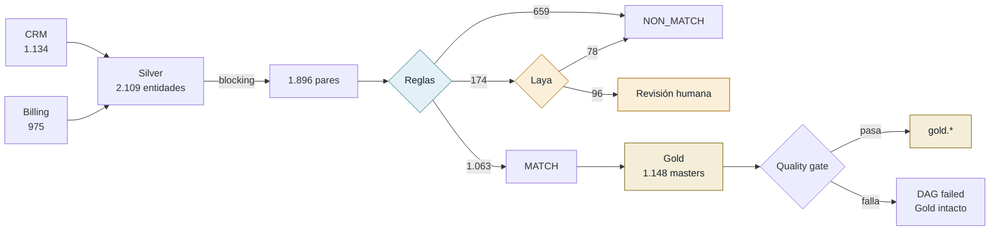
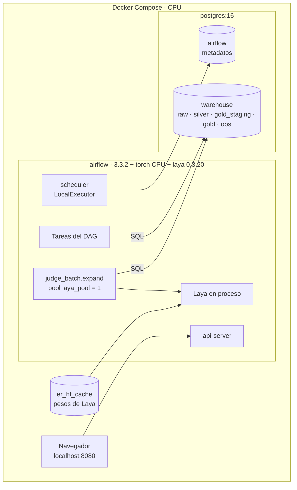

# Entity Resolution PoC

Laboratorio para unificar clientes de dos sistemas (CRM y Billing) en una tabla Gold con un `master_id` por persona real, orquestado con **Airflow 3.3** sobre **Postgres 16**.

La pregunta que responde: **¿un modelo de decisión local ([Laya](https://github.com/NandhaKishorM/laya)) reduce la cola de revisión humana que dejan las reglas determinísticas?** Todo se mide contra datos sintéticos con ground truth.

> **Resultado corto:** no, con estos datos. Las reglas resuelven el 91 % de los pares con precisión 0.995. Sobre los casos que dejan en duda, Laya (sin fine-tuning) no separa mejor que el azar (AUC 0.49). Detalle en [Resultados](#resultados).

Explicación visual del flujo y la arquitectura: [`docs/flujo.html`](docs/flujo.html).

---

## Cómo funciona

El pipeline es una **cascada**: la etapa barata decide todo lo que puede y la cara solo mira lo que queda.



<sub>Números del run `cascade1`, todos los splits.</sub>

| Etapa | Tarea | Qué hace |
|---|---|---|
| Bronze | `ingest_bronze` | Copia los CSV fuente a `raw.*` sin transformar. |
| Silver | `normalize_silver` | Esquema común: nombres sin acentos, email sin `+tag` ni puntos de Gmail, teléfono E.164, fechas ISO. |
| Candidatos | `build_pairs` | Blocking por email, teléfono o soundex(apellido)+ciudad con `name_sim ≥ 0.6`. Features de acuerdo y similitud por campo. |
| Reglas | `decide_rules` | Regresión logística sobre features → `p_match` → MATCH / NON_MATCH / REVIEW. Umbrales ajustados en *dev*. |
| Laya | `judge_batch.expand` → `decide_laya` | Solo pares en REVIEW. Laya responde P(misma persona); una segunda regresión decide si el par sale de la cola. |
| Gold | `build_gold_staging` | Union-find sobre MATCH, `master_id = uuid5(min(entity_key))`, supervivencia por campo (valor no nulo más reciente). |
| Gate | 3 checks SQL → `publish_gold` | Validación sobre staging. Si pasa, Gold se reemplaza en una transacción; si falla, el DAG falla y Gold no cambia. |

## Arquitectura



## Decisiones de diseño

| Decisión | Por qué |
|---|---|
| **Cascada: reglas primero, Laya solo en REVIEW** | Laya en CPU procesa ~2,4 pares/s. Correrlo sobre todos los pares llevaba el run de ~1 a ~15 min para +1,1 pp de automatización. En cascada, Laya corre ~1 min y se mide donde puede aportar. |
| **Tres zonas de decisión** | Un NON_MATCH seguro no es un match. Lo que no supera los umbrales va a un humano, no a Gold. |
| **Un error del modelo nunca produce un match** | Una respuesta inválida o un lote caído dejan el par en REVIEW (`trigger_rule="all_done"`). |
| **Umbrales aprendidos, no fijados** | Se ajustan en *dev* para una precisión objetivo configurable. Las métricas se reportan sobre *test*. |
| **Ruteo por columna, no `@task.branch`** | `@task.branch` elige tareas, no filas. Los datos viven en Postgres; por XCom solo viajan IDs de lote. |
| **Laya en proceso, pool de 1 slot** | Sin servicio extra. Dos modelos en paralelo en CPU se frenaban ~5×; uno a la vez con todos los cores rinde más. |
| **Write-audit-publish** | El gate valida `gold_staging`; Gold cambia entero o no cambia. |
| **Full refresh determinístico** | Misma semilla → mismo Gold (verificado por hash). Sin cache ni estado incremental. |
| **Lógica fuera del DAG** | `src/er/` no importa Airflow: se testea solo y se puede mover a otro orquestador. |

## Resultados

Run `cascade1`, 24/09/2026. 1.000 personas sintéticas (+6 % homónimos), CPU (Apple M5, Docker, 10 vCPU). Métricas sobre *test* (40 % de las personas, nunca vistas al entrenar).

| Etapa | Qué pasó | Tiempo |
|---|---|---|
| Reglas | Resolvieron el 91,3 % de los pares, precisión de MATCH 0.995. Dejaron 65 en REVIEW, 30 de ellos la misma persona. | segundos |
| Laya sobre la cola | Resolvió 20 de 65 (todos NON_MATCH) con 5 errores: precisión 0.75. AUC dentro de la cola: 0.49. | 71 s · 174 pares |
| Laya sobre todos los pares (run previo) | AUC 0.92, pero +1,1 pp de automatización: su señal está en los pares fáciles, que las reglas ya resuelven. | ~14 min |
| Checkpoint `multilingual` | AUC 0.49 sobre todos los pares. Descartado. | — |
| Quality gate | Con un duplicado inyectado en staging, el DAG falla y Gold no cambia. | — |
| Idempotencia | Dos runs seguidos producen el mismo hash de Gold. | — |

**Límites:**
- Datos sintéticos: el ruido lo define el generador.
- Una sola semilla.
- La cola de *dev* tiene ~100 pares, así que los umbrales de la etapa Laya se ajustan con pocos ejemplos.
- Laya se usó zero-shot, sin fine-tuning.

**Siguientes experimentos:**
- Varias semillas, para medir la variación de los resultados.
- Un dataset con menos email y teléfono compartidos, para que la cola de REVIEW sea más grande.
- Fine-tuning de Laya sobre pares de la cola.
- Muestra real anonimizada.

## Correrlo

Requisitos: Docker con 8 GB de RAM o más.

```bash
docker volume create er_hf_cache
make up          # Postgres + Airflow en http://localhost:8080
make run         # cascada completa: reglas → Laya → Gold (~2 min; la primera vez descarga ~1,7 GB de pesos)
make run-rules   # solo reglas, sin Laya (~1 min)
make gate-test   # inyecta un duplicado en staging: el DAG debe fallar y Gold no cambiar
make test        # tests unitarios
make psql        # consola del warehouse
```

Usuario de la UI: `admin`. Contraseña:

```bash
docker compose exec airflow cat /opt/airflow/simple_auth_manager_passwords.json.generated
```

Cada run escribe `reports/benchmark.md` con la calidad por etapa, la cola de REVIEW, los tiempos de Laya y el hash de Gold.

| Param del DAG | Uso |
|---|---|
| `checkpoints` | `["english"]`, o `[]` para correr sin Laya |
| `primary` | `english` (cascada) o `baseline` (solo reglas) alimenta Gold |
| `n_people` / `seed` | tamaño y semilla del dataset sintético |
| `batch_size` | pares por tarea de Laya |
| `inject_duplicate` | duplica un master en staging para probar el gate |

## Estructura

```
dags/entity_resolution.py   DAG (solo orquestación)
src/er/
  synthetic.py              dataset sintético + ground truth
  normalize.py              Bronze → Silver
  pairs.py                  blocking + features
  judge.py                  Laya: carga, prompt tipado, validación de respuesta
  decide.py                 regresión, umbrales, ruteo, esquema Pydantic
  gold.py                   union-find, golden record, publicación
  report.py                 métricas → reports/benchmark.md
sql/                        creación del warehouse y esquemas
tests/test_unit.py          tests unitarios
scripts/run_dag.sh          dispara un run y espera el resultado
docs/flujo.html             explicación visual
```

## Stack

Airflow 3.3.2 (TaskFlow, Dynamic Task Mapping, Pools, `common-sql` checks) · Postgres 16 · Laya 0.3.20 sobre PyTorch CPU · pandas · scikit-learn · rapidfuzz · phonenumbers · Pydantic v2 · Faker · Docker Compose.
