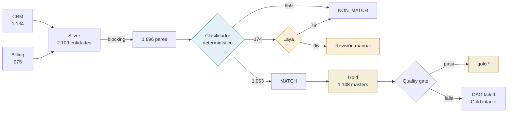
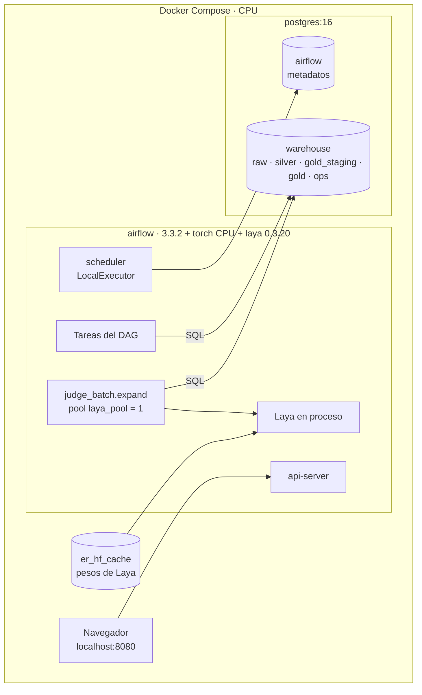

# Entity Resolution PoC

Pipeline de resolución de entidades que consolida registros de dos sistemas fuente (CRM y Billing) en una tabla maestra con un `master_id` por persona. Orquestado con Apache Airflow 3.3 sobre PostgreSQL 16.

El objetivo es evaluar si un modelo de decisión local y no generativo ([Laya](https://github.com/NandhaKishorM/laya)) reduce el volumen de revisión manual que deja un clasificador determinístico, sin degradar la precisión. La evaluación se hace sobre datos sintéticos con ground truth.

**Hallazgo principal:** con este dataset y sin fine-tuning, no lo reduce.
- El clasificador determinístico resuelve el 91,3 % de los pares con precisión 0.995.
- Sobre la zona de incertidumbre, la probabilidad de Laya no tiene poder discriminante (AUC 0.49).

Ver [Resultados](#resultados).

Documentación visual del flujo y la arquitectura: [`docs/flujo.html`](docs/flujo.html).

---

## Arquitectura del pipeline

El pipeline decide en **cascada**:
1. Un clasificador determinístico evalúa todos los pares candidatos.
2. Clasifica como MATCH o NON_MATCH los pares cuya probabilidad cae fuera de la zona de incertidumbre.
3. Solo los pares dentro de esa zona (REVIEW) pasan al modelo.

Así el costo de inferencia queda acotado al subconjunto donde el modelo puede aportar información.



<sub>Volúmenes del run `cascade1`, todos los splits.</sub>

| Capa | Tarea | Responsabilidad |
|---|---|---|
| Bronze | `ingest_bronze` | Ingesta sin transformación de los CSV fuente en `raw.*`. |
| Silver | `normalize_silver` | Esquema canónico. Normalización de nombres (transliteración, casing), email (alias `+tag`, puntos en Gmail), teléfono (E.164) y fechas (ISO 8601). |
| Candidatos | `build_pairs` | Blocking por email, teléfono y `soundex(apellido) + ciudad` con filtro `name_sim ≥ 0.6`. Features de concordancia y similitud por campo. |
| Decisión (1) | `decide_rules` | Regresión logística sobre las features → `p_match` → MATCH / NON_MATCH / REVIEW. |
| Decisión (2) | `judge_batch.expand` → `decide_laya` | Inferencia de Laya sobre los pares en REVIEW, en lotes mapeados dinámicamente. Una segunda regresión combina las features con `p_same` sobre esa población. |
| Gold | `build_gold_staging` | Clausura transitiva de los MATCH (union-find), `master_id = uuid5(min(entity_key))`, supervivencia por campo (valor no nulo más reciente). |
| Publicación | 3 checks SQL → `publish_gold` | Write-audit-publish: validación sobre `gold_staging` y reemplazo atómico de `gold.*` en una transacción. |

## Infraestructura



## Decisiones de diseño

| Decisión | Justificación | Trade-off |
|---|---|---|
| **Inferencia en cascada** | La inferencia de Laya en CPU rinde ~2,4 pares/s. Aplicada sobre todos los candidatos, llevaba el run de ~1 a ~15 min con una mejora marginal de automatización (+1,1 pp). Restringida a REVIEW, cuesta ~70 s. | El modelo no puede corregir errores del clasificador fuera de la zona de incertidumbre. |
| **Tres clases de decisión** | Separa la certeza negativa (NON_MATCH) de la incertidumbre (REVIEW). Solo los MATCH generan aristas en Gold. | Un volumen de revisión manual no nulo. |
| **Fail-safe ante errores del modelo** | Respuestas inválidas o lotes fallidos dejan el par en REVIEW (`trigger_rule="all_done"`). Ningún fallo produce un merge. | La indisponibilidad del modelo degrada la automatización, no la calidad. |
| **Umbrales ajustados en *dev*** | τ_high / τ_low se eligen por precisión y NPV objetivo (parámetro); las métricas se reportan sobre *test*, split por persona. | Con zonas de incertidumbre chicas, el ajuste de la segunda etapa se hace con pocos ejemplos. |
| **Ruteo por partición de datos** | La decisión es una columna de `silver.pairs`; cada etapa filtra por ella. `@task.branch` selecciona tareas, no filas. Por XCom solo viajan identificadores de lote. | Todas las tareas downstream se ejecutan, aunque su partición esté vacía. |
| **Modelo en proceso con pool de 1 slot** | Evita un servicio de inferencia adicional. Con dos instancias concurrentes en CPU el throughput cayó ~5× por contención; serializado usa todos los cores. | Cada tarea recarga el modelo (~10 s). Un servicio dedicado o un worker persistente eliminaría ese costo. |
| **Write-audit-publish** | El gate valida `gold_staging`; `gold.*` se reemplaza en una transacción o no se modifica. | Full refresh de Gold en cada run. |
| **Ejecución determinística** | Semilla fija en el generador y full refresh: el mismo input produce el mismo Gold (verificado por hash). | Sin procesamiento incremental. |
| **Lógica desacoplada del orquestador** | `src/er/` no depende de Airflow: se testea de forma aislada y es portable a otro orquestador (Temporal, Databricks Jobs). | El DAG solo compone llamadas; la validación de datos vive en el paquete. |

## Metodología de evaluación

- **Dataset:** 1.000 personas sintéticas más 6 % de homónimos (personas distintas con igual nombre y ciudad), proyectadas a ambas fuentes con duplicados internos. El ruido está parametrizado: errores tipográficos, hipocorísticos, alias y cambios de email, formatos y cambios de teléfono, mudanzas y campos faltantes.
- **Split por persona:** 60 % *dev* para entrenamiento y ajuste de umbrales, 40 % *test* para las métricas reportadas. No hay pares de una misma persona en ambos splits.
- **Métricas por etapa:**
  - precisión de MATCH y NPV de NON_MATCH;
  - tasa de automatización;
  - tamaño y composición de la cola REVIEW;
  - AUC de `p_same` dentro de la cola;
  - errores introducidos por el modelo;
  - latencia y throughput de inferencia.
- **Métricas del pipeline:** blocking recall, conteo de masters y hash de Gold para verificar la idempotencia.

## Resultados

Run `cascade1` (24/09/2026). CPU: Apple M5, Docker, 10 vCPU. Métricas sobre *test*.

| Configuración | Resultado | Latencia |
|---|---|---|
| Clasificador determinístico | 91,3 % de automatización, precisión de MATCH 0.995, NPV 0.979. Cola REVIEW: 65 pares, 30 de ellos matches verdaderos. | segundos |
| Laya sobre la cola REVIEW | 20 de 65 pares resueltos, todos como NON_MATCH, con 5 errores (precisión 0.75). AUC de `p_same` en la cola: 0.49. | 71 s · 174 pares |
| Laya sobre todos los candidatos | AUC 0.92, +1,1 pp de automatización. El poder discriminante se concentra en pares que el clasificador ya resuelve. | ~14 min |
| Checkpoint `multilingual` | AUC 0.49 sobre todos los candidatos. Descartado. | — |
| Quality gate | Un master duplicado inyectado en staging hace fallar el DAG y `gold.*` no se modifica. | — |
| Idempotencia | Hash de Gold idéntico entre ejecuciones consecutivas. | — |

**Interpretación:** en este dataset, la señal que Laya captura (similitud general entre registros) ya está contenida en las features determinísticas. En los pares ambiguos, su salida no discrimina. El valor de la cascada es metodológico: aísla la población donde un modelo adicional tendría que demostrar valor y hace ese experimento barato de repetir (~1,6 min por run).

### Limitaciones

- La distribución del ruido la define el generador, no un sistema productivo.
- Una sola semilla: no se reporta varianza.
- La cola de *dev* tiene ~100 pares, lo que limita el ajuste de la segunda etapa.
- Laya se evaluó zero-shot.
- Blocking recall de 0.951: el ~5 % de los pares verdaderos no llega a evaluarse.

### Trabajo futuro

- Múltiples semillas e intervalos de confianza.
- Datasets con menor cobertura de identificadores fuertes (email, teléfono), para ampliar la zona de incertidumbre.
- Fine-tuning de Laya sobre pares de la cola REVIEW.
- Validación sobre una muestra real anonimizada.
- Mejorar el blocking recall: claves fonéticas adicionales y blocking por embeddings.

## Ejecución

Requisitos: Docker con 8 GB de RAM o más.

```bash
docker volume create er_hf_cache
make up          # PostgreSQL + Airflow en http://localhost:8080
make run         # pipeline completo (~2 min; el primer run descarga ~1,7 GB de pesos)
make run-rules   # solo clasificador determinístico (~1 min)
make gate-test   # verifica que el quality gate bloquea la publicación
make test        # tests unitarios
make psql        # consola del warehouse
```

Credenciales de la UI: usuario `admin`; contraseña en
`docker compose exec airflow cat /opt/airflow/simple_auth_manager_passwords.json.generated`.

Cada run genera `reports/benchmark.md` con las métricas por etapa, la composición de la cola REVIEW, la latencia de inferencia y el hash de Gold.

| Parámetro | Descripción |
|---|---|
| `checkpoints` | Checkpoints de Laya a evaluar. `[]` desactiva la segunda etapa. |
| `primary` | Configuración que alimenta Gold: `english` (cascada) o `baseline` (solo reglas). |
| `n_people`, `seed` | Tamaño y semilla del dataset sintético. |
| `batch_size` | Pares por tarea de inferencia. |
| `inject_duplicate` | Inyecta un duplicado en staging para validar el quality gate. |

## Estructura

```
dags/entity_resolution.py   definición del DAG (solo orquestación)
src/er/
  synthetic.py              generador de datos y ground truth
  normalize.py              Bronze → Silver
  pairs.py                  blocking y features
  judge.py                  integración con Laya y validación de respuestas
  decide.py                 clasificadores, ajuste de umbrales, esquema Pydantic
  gold.py                   clausura transitiva, supervivencia, publicación
  report.py                 métricas y reporte por run
sql/                        DDL del warehouse
tests/                      tests unitarios
scripts/run_dag.sh          ejecución y espera de un run
docs/flujo.html             documentación visual
```

## Stack

Apache Airflow 3.3.2 (TaskFlow, Dynamic Task Mapping, Pools, `common-sql`) · PostgreSQL 16 · Laya 0.3.20 sobre PyTorch (CPU) · pandas · scikit-learn · RapidFuzz · phonenumbers · Pydantic v2 · Faker · Docker Compose.
